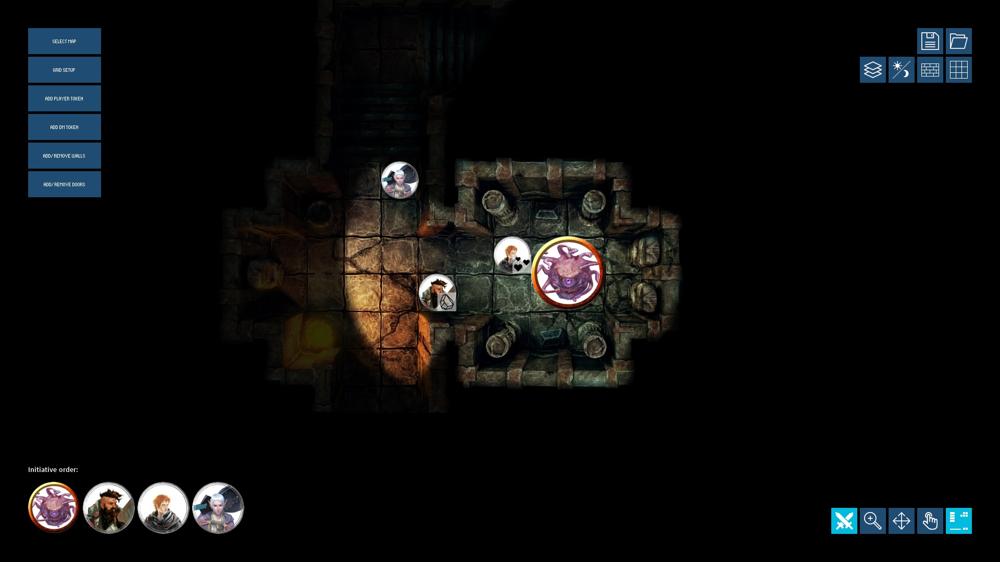

# dungeoneering
Combat grid and dungeon explorer for use in tabletop RPG sessions.

## Latest Version

The latest stable version along with release notes can be found on the project's
[releases](https://github.com/luiscastilho/dungeoneering/releases) page.

## Installation

1. Download and install [Java 8](https://java.com/en/download/).
2. In the [releases](https://github.com/luiscastilho/dungeoneering/releases) page, download the
appropriate file for your operating system.
3. Extract all files to a folder of your choice - `Documents/dungeoneering` for example.
4. Run the `dungeoneering.exe`/`dungeoneering` executable.

You can either create a new scene - select an image/video to use as a map, setup a grid, add
tokens, etc - or you can load an example scene from the `data/scenes` folder.

To exit the application, press `ESC`.

## Contributing

dungeoneering code can be loaded and run directly in [Processing](https://processing.org/) IDE.
Clone this repository and open the `dungeoneering.pde` file in Processing.

Bugs can be reported through the project's
[issues](https://github.com/luiscastilho/dungeoneering/issues) page.

## License

dungeoneering is licensed under the GPLv3. See [LICENSE](LICENSE) for more details. dungeoneering
also uses components from other open source projects:

- [Processing](https://github.com/processing/processing)
- [ControlP5](https://github.com/sojamo/controlp5)
- [PostFX for Processing](https://github.com/cansik/processing-postfx)
