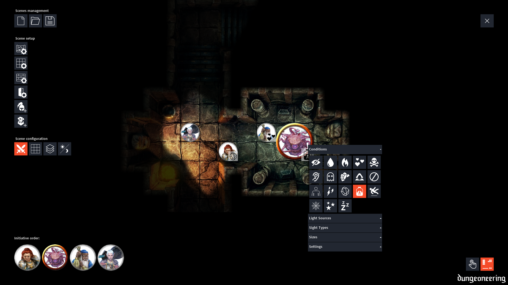

# dungeoneering
dungeoneering is a minimalistic combat grid and dungeon explorer for use in local tabletop RPG sessions. It can load static and animated maps, has a dynamic lighting system, offers lots of conditions that can be easily applied to tokens and more.

The main goal here is to make an application with all the basic features needed to run a tabletop RPG session. It should be easy to install, setup and run and should have a minimalistic, intuitive and hopefully pretty user interface.

## Latest Version

The latest stable version along with release notes can be found on the project's [releases](https://github.com/luiscastilho/dungeoneering/releases) page.

## Installation

1. In the [releases](https://github.com/luiscastilho/dungeoneering/releases) page, download the appropriate file for your operating system.
2. Extract all files to a folder of your choice — `Documents/dungeoneering` for example.
3. Run `dungeoneering.exe`, `dungeoneering.app`, or `dungeoneering` depending on your system.

### Windows

The application should work with the instructions above. If it doesn't, create an issue please.

### macOS

macOS releases are created and tested in a virtual machine running Catalina. Not sure if it will work on older macOS releases but I hope so. Create an issue if it doesn't and let me know.

### Linux

There's an extra step to run dungeoneering in Linux - GStreamer must be installed on your system. Installation instructions can be found [here](https://gstreamer.freedesktop.org/documentation/installing/on-linux.html). If it doesn't work even with GStreamer installed, create an issue please.

## How to Use It

To see how a scene looks like once it's composed you can load one of the example scenes that come with the application. Click on the load scene button () and choose a scene (`*.json` files) from the `data/scenes` folder.

To create a new scene follow the steps below. It might be better to do this when preparing an RPG session and not during it, since your players might get bored while they wait.

1. Click on the map setup button () and choose an image or video to use as a map.
2. Click on the grid setup button () and follow the on-screen instructions to setup a grid over the map you chose.
3. Add player () and DM tokens () using the corresponding buttons.
4. Setup walls () and doors () using the corresponding buttons and following the on-screen instructions. Walls and doors are used to hide parts of the map and to block token light sources. With these elements in place you will have a dynamic lighting system, where players will only see parts of the map depending on where their characters are and what they can see.
5. If it's a combat scene, enable the initiative order widget by clicking on the combat button (). In this widget you can drag players or enemies to the position they should occupy based on the initiative they rolled.
6. Save your scene using the save button () so you can load it when needed during your RPG sessions.

And that's it! Now that you have setup your scene, players and DM can drag their tokens around the map; right click on them to add conditions, light sources and sight types (e.g., darkvision); pan and zoom the map as needed; players can reveal hidden parts of the map with the dynamic lighting system; and hopefully with all that you and your group will have more fun in your RPG sessions. :)

## Contributing

dungeoneering code can be loaded, edited and run directly in [Processing](https://processing.org/) IDE. Clone this repository and open the `dungeoneering.pde` file in Processing.

Bugs can be reported through the project's [issues](https://github.com/luiscastilho/dungeoneering/issues) page. Also, there's a list of features to implement and known bugs to fix in the [TODO list](TODO.md).

## License

dungeoneering is licensed under the GPLv3. See [LICENSE.md](../LICENSE.md) for more details. dungeoneering also uses components from other open source projects. Their code and license can be found at these links:

- [Processing](https://github.com/processing/processing)
- [ControlP5](https://github.com/sojamo/controlp5) ([Forked](https://github.com/luiscastilho/controlp5) and customized)
- [PostFX for Processing](https://github.com/cansik/processing-postfx)
- [UiBooster](https://github.com/Milchreis/uibooster-for-processing)

## Assets

There are a few demo scenes bundled with the application. The assets used in these scenes can be found at or created using the following links.

- The two awesome animated maps are from [Animated Dungeon Maps](https://www.patreon.com/animatedmaps "Animated Dungeon Maps Patreon page").
- The [Abandoned Farmhouse map](../dungeoneering/data/maps/Static-AbandonedFarmhouse.jpg) is from Mike Schley, available in this [D&D article](https://dnd.wizards.com/articles/features/schley-stack "D&D Schley Stack article").
- The [Beholder Lair map](../dungeoneering/data/maps/Static-BeholderLair.jpg) is from [Antal Kéninger](https://www.artstation.com/kena "Antal Kéninger ArtStation profile").
- The [The Old Bridge map](../dungeoneering/data/maps/Static-TheOldBridge.jpg) is from [Sliph](https://www.patreon.com/sliph "Sliph Patreon").
- All tokens were created using [RollAdvantage's Token Stamp tool](https://rolladvantage.com/tokenstamp/ "Token Stamp tool") with D&D 5th edition images.

## Thanks

Thanks to my awesome RPG group that supported me in developing this application and were patient enough to playtest it in our sessions. :heart:

[")](#thanks)
[")](#thanks)
[")](#thanks)
[")](#thanks)
[")](#thanks)
[")](#thanks)

And thanks to [Animated Dungeon Maps](https://www.patreon.com/animatedmaps "Animated Dungeon Maps Patreon page") for letting me use some of his maps on the demo scenes and even lending me an [exclusive map](../dungeoneering/data/maps/Animated-SwordCoast.mp4). Much appreciated! :+1:

