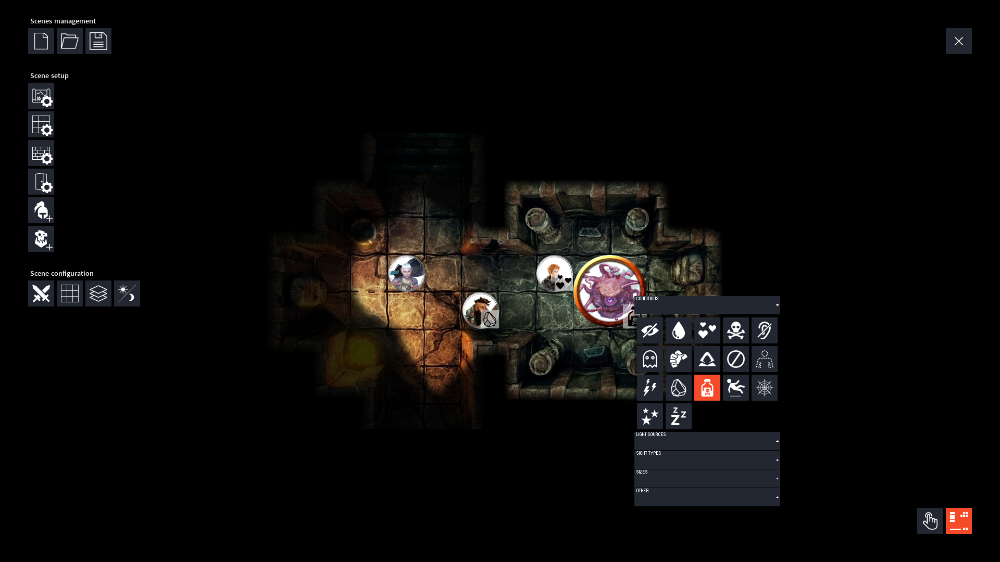

# dungeoneering
dungeoneering is a minimalistic combat grid and dungeon explorer for use in local tabletop RPG sessions. It can load static and animated maps, has a dynamic lighting system, offers lots of conditions that can be easily applied to tokens and more.

The main goal here is to make an application with all the basic features needed to run a tabletop RPG session. It should be easy to install, setup and run and should have a minimalistic, intuitive and hopefully pretty user interface.

## Latest Version

The latest stable version along with release notes can be found on the project's [releases](https://github.com/luiscastilho/dungeoneering/releases) page.

## Installation

1. Download and install [Java 8](https://java.com/en/download/).
2. In the [releases](https://github.com/luiscastilho/dungeoneering/releases) page, download the appropriate file for your operating system.
3. Extract all files to a folder of your choice - `Documents/dungeoneering` for example.
4. Run the `dungeoneering.exe`/`dungeoneering` executable.

You can either create a new scene - select an image/video to use as a map, setup a grid, add tokens, etc - or you can load an example scene from the `data/scenes` folder.

To exit the application, press `ESC`.

### Windows

The application should work with the instructions above. If it doesn't, crate an issue please.

### macOS

macOS releases are created and tested in a virtual machine running Catalina. Not sure if it will work on older macOS releases. Create an issue if it doesn't and let me know.

### Linux

There's an extra step to run the application in Linux - GStreamer must be installed on your system. Installation instructions can be found [here](https://gstreamer.freedesktop.org/documentation/installing/on-linux.html). If it doesn't work even with GStreamer installed, create an issue please.

## Contributing

dungeoneering code can be loaded, edited and run directly in [Processing](https://processing.org/) IDE. Clone this repository and open the `dungeoneering.pde` file in Processing.

Bugs can be reported through the project's [issues](https://github.com/luiscastilho/dungeoneering/issues) page. Also, there's a list of features to implement and known bugs to fix in the [TODO list](TODO.md).

## License

dungeoneering is licensed under the GPLv3. See [LICENSE.txt](LICENSE.txt) for more details. dungeoneering also uses components from other open source projects:

- [Processing](https://github.com/processing/processing)
- [ControlP5](https://github.com/sojamo/controlp5)
- [PostFX for Processing](https://github.com/cansik/processing-postfx)
